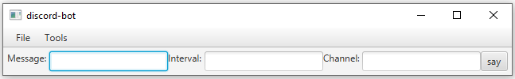
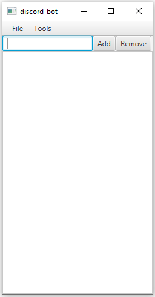

## Overview
discord-bot (better name pending) is a moderation bot for discord servers. Its purpose is to provide moderation utilities to server owners through an (hopefully) easy-to-use graphical interface. 




Official releases are yet to come. At the moment, the bot has the following basic functionalities:

- send messages to a channel on a regular interval
- block certain words/phrases from appearing on a server-wide level
- load bot token and words/phrase to block from a configurations file
- saving bot token and words/phrase to block to a configuration file

## Table of Contents

  - [Overview](#overview)
  - [Table of Contents](#table-of-contents)
  - [Installation](#installation)
 
## Installation

#### 1. Install Java

discord-bot requires Java version 1.8.0_221. It can be downloaded from [here](https://www.oracle.com/technetwork/java/javase/downloads/jdk8-downloads-2133151.html).

#### 2. Download the bot

discord-bot is ment to be hosted on a client's computer/server. Therfore, you should download and run the bot off of your host computer. To do so, download the runnable jar file [discord-bot.jar](discord-bot.jar) from the repository. In the future and once more features are added to the bot, official releases will be downloadable from the release section of this repository.

#### 3. Create the cfg.txt file

discord-bot uses a configurations file to store information about tokens, filter lists, etc. `discord-bot.jar` automatically creates the configuration file on start-up if it doesn't already exist. To do this, run the bot with the following terminal command,
```
java -jar /path/to/bot/discord-bot.jar
```

The configuration file `cfg.txt` should be created in the same directory of `discord-bot.jar`. Its contents are as follows,

```
DISCORD-BOTCONFIGURATIONFILESTART
your-bot-token
PROFANITYLISTSTART
PROFANITYLISTEND
DISCORD-BOTCONFIGURATIONFILEEND
```

#### 4. Create a bot in the discord developer portal

Since the bot is ran off of the client's computer, they will have to create their own application for it under the discord developers portal. To do this, go to the [discord developers portal](https://discordapp.com/developers/applications/). Under the <i>applications</i> tab, click on <b>New Application</b>. Then, under the <i>Bot</i> tab, click on <b>New Bot</b>. Once created, click the <b>Copy</b> button under the <i>token</i> section. In the `cfg.txt` file, replace `your-bot-token` with the copied text. Finally, go to the <i>general information</i> tab and click <b>Copy</b> under the <i>client id</i> section. Replace `YOUR-CLIENT-ID` in 
`https://discordapp.com/oauth2/authorize?&client_id=YOUR-CLIENT-ID&scope=bot&permissions=8` with the copied text. Then use the client and add the bot to your server.

#### 5. Grant permissions and run the bot

Given that this bot is intended to moderate your discord server, it would be best to grant it an admin role. Afterwards, you can run the bot with the following terminal command,
```
java -jar /path/to/bot/discord-bot.jar 
```
