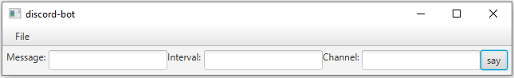

# discord-bot
discord-bot (better name pending) is a simple discord bot with a GUI.

At the moment, it has the basic functionally of sending messages to a channel on a regular interval.

## Table of Contents

  - [discord-bot](#discord-bot)
  - [Table of Contents](#table-of-contents)
  - [Installation](#installation)
 
## Installation

discord-bot requires Java version 1.8.0_221. It can be downloaded from [here](https://www.oracle.com/technetwork/java/javase/downloads/jdk8-downloads-2133151.html).
