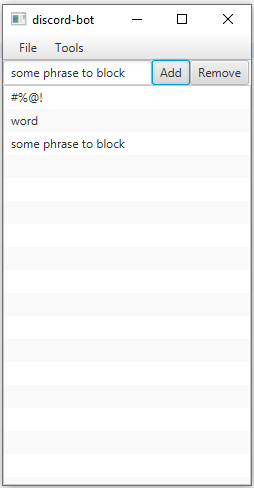

## Overview
discord-bot (better name pending) is a moderation bot for discord servers. Its purpose is to provide moderation utilities to server owners through an (hopefully) easy-to-use graphical user interface (GUI). 




Official releases are yet to come. At the moment, the bot has the following basic functionalities:

- send messages to a channel on a regular interval
- block certain words/phrases from appearing on a server-wide level
- load bot token and words/phrase to block from a configuration file
- save bot token and words/phrase to block to a configuration file

## Table of Contents

  - [Overview](#overview)
  - [Table of Contents](#table-of-contents)
  - [Installation](#installation)
  - [Usage](#usage)
    - [Launch](#launch)
    - [Say Tool](#say-tool)
      - [Demo](#example-1)
    - [Profanity Filter Tool](#profanity-filter-tool)
      - [Demo](#example-2)
  - [Contribution](#contribution)
  - [License](#license)
 
## Installation

This section provides a step-by-step installation guide for users.

#### 1. Install Java

discord-bot requires Java version 1.8. It can be downloaded from [here](https://www.java.com/en/download/).

#### 2. Download the bot

discord-bot is ment to be hosted on a client's computer/server. Therfore, you should download and run the bot off of your host computer. To do so, download the runnable jar file [discord-bot.jar](discord-bot.jar) from the repository. In the future and once more features are added to the bot, official releases will be downloadable from the release section of this repository.

#### 3. Create the cfg.txt file

discord-bot uses a configurations file to store information about tokens, filter lists, etc. `discord-bot.jar` automatically creates the configuration file on start-up if it doesn't already exist. To do this, run the bot with the following terminal commands,
```
cd /path/to/bot/
java -jar discord-bot.jar
```

The configuration file `cfg.txt` should be created in the same directory of `discord-bot.jar`. Its contents are as follows,

```
DISCORD-BOTCONFIGURATIONFILESTART
your-bot-token
PROFANITYLISTSTART
PROFANITYLISTEND
DISCORD-BOTCONFIGURATIONFILEEND
```

#### 4. Create a bot in the discord developer portal

Since the bot is ran off of the client's computer, they will have to create their own application for it under the discord developers portal. To do this, go to the [discord developers portal](https://discordapp.com/developers/applications/). Under the applications tab, click on New Application. Then, under the Bot tab, click on New Bot. Once created, click the Copy button under the token section. In the `cfg.txt` file, replace `your-bot-token` with the copied text. Finally, go to the general information tab and click Copy under the client id section. Replace `YOUR-CLIENT-ID` in 
`https://discordapp.com/oauth2/authorize?&client_id=YOUR-CLIENT-ID&scope=bot&permissions=8` with the copied text. Then use the link to add the bot to your server.

#### 5. Grant permissions

Given that this bot is intended to moderate your discord server, it would be best to grant it an admin role. 

## Usage

#### Launch

To start the bot, run the following commands in the terminal,

```
cd /path/to/bot/
java -jar discord-bot.jar 
```

##### Example:

```
Microsoft Windows [Version 10.0.18362.535]
(c) 2019 Microsoft Corporation. All rights reserved.

C:\Users\Patrick Yevych>cd Desktop

C:\Users\Patrick Yevych\Desktop>java -jar discord-bot.jar
SLF4J: Failed to load class "org.slf4j.impl.StaticLoggerBinder".
SLF4J: Defaulting to no-operation (NOP) logger implementation
SLF4J: See http://www.slf4j.org/codes.html#StaticLoggerBinder for further details.
SLF4J: Failed to load class "org.slf4j.impl.StaticMDCBinder".
SLF4J: Defaulting to no-operation MDCAdapter implementation.
SLF4J: See http://www.slf4j.org/codes.html#no_static_mdc_binder for further details.
[JavaFX Application Thread] INFO JDA - Login Successful!
true
[JDA MainWS-WriteThread] INFO WebSocketClient - Connected to WebSocket
[JDA MainWS-ReadThread] INFO JDA - Finished Loading!
```

The user is able to save/load the configurations file and switch between moderation tools via the menu bar at the top of the program.

There are currently 2 moderation tools: Say and Profanity Filter.

#### Say Tool

The Say tool allows the user to send a message to a specified channel on a timed interval. The user specifies the message to send, the interval (in seconds) to send the message on and the name of the channel to send the message to using the textboxes. Channels with duplicate names may cause issues with the tool. The say button acts as a toggle button; allowing the user to turn the tool on or off.

##### Example:

In the following example, the message "This is an example message that is sent every second to the text-channel." is sent to the channel "text-channel" every second, 


#### Profanity Filter Tool

The Profanity Filter tool allows the user to block certain words/phrases from appearing on all text channel. If a server member sends a message that contains one or more of the blocked words, then the bot will promptly delete that message. The user can add new words to block by typing in the word in the text box and then pressing Add. Likewise, the user can remove words that are currently in the block list by typing in the word and then pressing Remove.

##### Example:

In the following example, messages that contain the word "hate" are blocked,


## Contribution

discord-bot requires the following dependencies: 

- Java SE JDK 8u231 and JavaFX for Java 1.8. They can be downloaded from [here](https://www.oracle.com/technetwork/java/javase/downloads/jdk8-downloads-2133151.html). 
- [JDA version 4.0.0_79](https://github.com/DV8FromTheWorld/JDA). It is already set up in [pom.xml](pom.xml).

Any IDE should work fine as long as it recognizes the JavaFX libraries. I specifically use [Eclipse IDE for Java Developers version 4.13.0](https://www.eclipse.org/downloads/packages/release/2019-09/r) with the [e(fx)clipse](http://download.eclipse.org/efxclipse/updates-released/3.0.0/site) plugin to develop the bot. [This](https://o7planning.org/en/10619/install-efxclipse-into-eclipse) website is a good resource on how to install e(fx)clipse. 

The organization of this repository is based off of the feature branch workflow. Features are documented in the [scrum](scrum) folder and branches are created for each major feature developement. Ensure that your fork follows this organization pattern and you document each feature development in the scrum backlogs.

## License

This repository is licensed under the GPL-3.0 license. See [LICENSE.md](LICENSE) for details.
